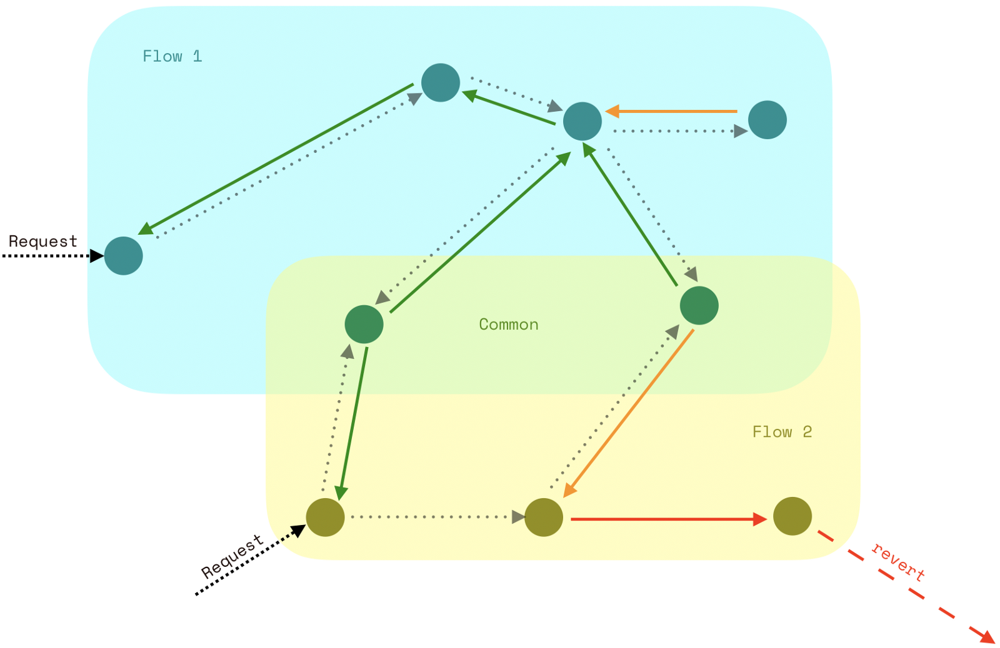
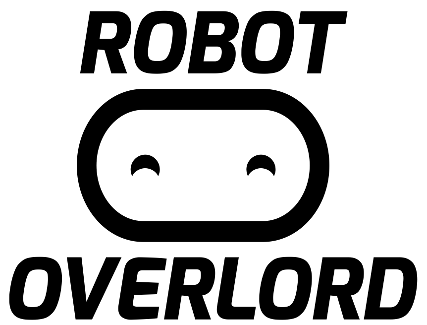
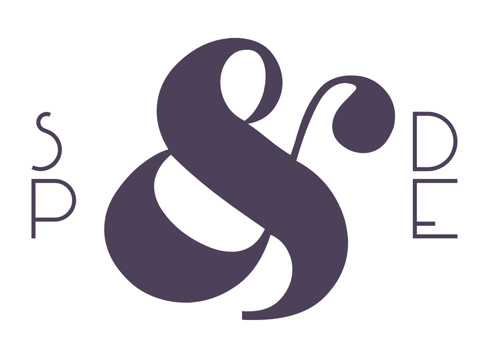

## Powering Mircoservices for Web3

[`FISSION`](https://fission.codes) is a set of useful status codes and translated messages to connect smart contracts of all kinds 🔌

[](https://travis-ci.org/fission-suite/fission-codes)
[](https://codeclimate.com/github/expede/ethereum-status-codes/maintainability)
[](https://coveralls.io/github/fission-suite/fission-codes)
<br>
[](https://eips.ethereum.org/EIPS/eip-1066)
[](https://github.com/ethereum/EIPs/blob/56f86922bbd3777174cdbf2e0d01d38c6306b9c0/EIPS/eip-1444.md)
[](https://github.com/ethereumclassic/ECIPs/blob/1562567351ee0c2f163beac65b73fc6872313c6b/ECIPs/ECIP-1050.md)
[](https://spade.builders)

# Quickstart

```bash
npm install --save fission-codes
```

```solidity
// Solidity
pragma solidity ^0.5.0;
import { FISSION } from "/fission-codes/contracts/FISSION.sol";
```

```js
// JavaScript
const * as fission = require('fission-codes');
```

# Table of Contents

* [TL;DR](#tl-dr)
* [Motivation](#motivation)
    * [Contract Autonomy](#contract-autonomy)
    * [Semantically Rich](#semantically-rich)
    * [User Feedback](#user-feedback)
    * [Shared State](#shared-state)
* [Example](#example)
    * [Scenario](#scenario)
    * [Smart Contracts](#smart-contracts)
* [Resources](#resources)
    * [Documentation](#documentation)
    * [Standards](#standards)
    * [Presentations](#presentations)
    * [Articles](#articles)
    * [Discussions](#discussions)
* [Badge](#badge)
* [Featured On](#featured-on)
* [Sponsors](#sponsors)

# TL;DR

FISSION helps us understand and build interoperable smart contract communication. It establishes a common vocabulary for smart contracts to interact with a rich set of messages to tag data and common situations. It has applications in state transfer, development tooling, instrumentation, and user messaging.

1. Improved feedback for humans (end users and developers alike)
2. Helping developers understand their code at runtime
3. Enhanced smart contract interoperability and autonomy

# Motivation

The very essence and power of having a shared platform like a programmable blockchain is how it facilitates the flow of information. We pay for this abstraction with a speed penalty, but at the application layer there is no need to worry about the common issues in distributed systems: availability, stale state, locked data, and so on. This is an oft-overlooked advantage of this technology, so let’s make the most of it!

"FISSION" stands for the **F**luid **I**nterface for **S**calable **S**mart Contract **I**nter**o**perable **N**etworks. Not to be confused with a [fluent interface](https://en.wikipedia.org/wiki/Fluent_interface), FISSION can be seen as a _fluid_ interface — an common interface flowing between nodes. This stands in contrast to the concrete interfaces that we commonly see today on Ethereum: method signatures. These are not mutually exclusive concepts, but rather two halves of a very powerful whole!

The core of the FISSION is status codes. These provide the common interface to build messages, flows, and protocols from. This strategy isn’t limited projects under the FISSION umbrella; everyone is encouraged to build robust protocols from these building blocks!

The idea is very simple: [256 codes](https://fission.codes/fission-codes/codes) organized as a [16x16 table](https://fission.codes/fission-codes/grid). The columns are categories (ex. [permissions](https://fission.codes/fission-codes/codes#0x1-permission--control), [time](https://fission.codes/fission-codes/codes#0x4-availability--time), [off-chain](https://fission.codes/fission-codes/codes#0xf-off-chain), etc), and the rows are reasons (ex. [failure, success, informational, required action](https://fission.codes/fission-codes/codes#0x0-generic)). They are passed around as the first value in a multi-value return, or as an argument to a function.

This library makes it easy to construct codes, inspect them for conditions, automatically revert on failures, retrieve human-readable localizations, and so on.

## Contract Autonomy

Smart contracts are largely intended to be autonomous. While each contract may define a specific interface, having a common set of semantic codes can help developers write code that can react appropriately to various situations.

## Semantically Rich

HTTP status codes are widely used for this purpose. BEAM languages use atoms and tagged tuples to signify much the same information. Both provide a lot of information both to the programmer (debugging for instance), and to the program that needs to decide what to do next.

FISSIONs convey a much richer set of information than booleans, and are able to be reacted to autonomously unlike arbitrary strings.

## User Feedback

Since status codes are finite and known in advance, we can provide global, human-readable sets of status messages. These may also be translated into any language, differing levels of technical detail, added as `revert` messages, natspecs, and so on.

We also see a desire for this [in transactions](http://eips.ethereum.org/EIPS/eip-658), and there's no reason that FISSIONs couldn't be used by the EVM itself.

## Shared State

Shared multi-user systems like Ethereum should lend themselves to easily sharing data. Data is decentralized in the sense that we don’t have one giant database with open access. Unlike how we can use on-chain libraries to share functionality (rather than redeploying the same classes over and over), the true value of most applications is the data that they contain. Unfortunately, the majority of bespoke architectures silo data behind access control and programmatic interfaces with only brittle and limited options for requesting this data. We need a way to help data flow between these silos.

The current state of the art is to use concrete interfaces and keep as much functionality contained in our single contract as possible. Overriding inherited contract functions may lead to unexpected behaviour to an external caller, not to mention that long inheritance chains being one of the most confusing forms of indirection.

This is complementary to concrete interfaces (like ERC20). method interfaces are primarily mechanical (the “how”), data and status codes are primarily semantic (the “what”).



In the above diagram, the dotted arrows are requests (or calls). The rest are responses (or returns) that contain FISSION codes; green arrows are success responses, and orange arrows are neither successes nor errors. By convention, the code is the first value in a request or multiple return.

# Example

## Scenario

It's common for one group of users to make use of several contracts. It would be useful to register this information once, and share it among many different contracts, rather than duplicating this information across many places (with potential inconsistencies).

For instance, if a teammate is promoted to admin status, this should be reflected across all of the shared contracts. Likewise, if someone is banned, it is much easier to make this change once and rest assured that it covers all of our contracts.

## Smart Contracts

Here is a contract that consolidates member rights in one place for this group of users. It returns a common set codes from FISSION as a simple way of communicating with other contracts (primarily about permissions).

```solidity
pragma solidity ^0.5.0;

import { FISSION } from "fission-codes/contracts/FISSION.sol";

contract SimpleAuth {
    enum Level {
        Banned,
        Unregistered,
        Member,
        Admin
    }

    mapping (address => Level) private auth;

    constructor() public {
        auth[tx.origin] = Level.Admin;
    }

    function min(Level minLevel) public view returns (byte status) {
        if (auth[tx.origin] == Level.Banned) { return FISSION.code(FISSION.Status.Revoked); }
        if (auth[tx.origin] < minLevel) { return FISSION.code(FISSION.Status.Disallowed_Stop); }
        return FISSION.code(FISSION.Status.Allowed_Go);
    }

    function set(address who, Level level) public returns (byte status) {
        require(auth[tx.origin] == Level.Admin, "Must be an admin");
        auth[who] = level;
        return FISSION.code(FISSION.Status.Success);
    }
}
```

There may be many collaborator contracts. Below is a portfolio controlled by the `SimpleAuth` members.

```solidity
pragma solidity ^0.5.0;

import { FISSION } from "fission-codes/contracts/FISSION.sol";
import { SimpleAuth } from "./SimpleAuth.sol";

contract Portfolio {
    SimpleAuth private auth;
    mapping (address => bool) private holdings;

    constructor (SimpleAuth control) public {
        auth = control;
    }

    function isHeld(address token) external view returns (byte status, bool held) {
        byte permission = auth.min(SimpleAuth.Level.Unregistered);
        if (isBlocking(permission)) { return (permission, false); }
        return (FISSION.code(FISSION.Status.Found_Equal_InRange), holdings[token]);
    }

    function setTracking(address token, bool track) external returns (byte status) {
        requireSuccess(auth.min(SimpleAuth.Level.Member));
        holdings[token] = track;
        return FISSION.code(FISSION.Status.Success);
    }
}
```

# Resources

## Documentation

* [Official Website](https://fission.codes)

## Standards

This library contains implementations of these standards:

### Ethereum Improvement Proposals (EIP)

* [ERC-1066: Status Codes](https://eips.ethereum.org/EIPS/eip-1066)
* [ERC-1444: Signal Translations](https://github.com/ethereum/EIPs/pull/1444)

### Ethereum Classic Improvement Proposals (ECIP)

* [ECIP-1050: Status Codes](https://github.com/ethereumclassic/ECIPs/blob/master/ECIPs/ECIP-1050.md)

## Presentations

* [Devcon IV (Prague)](https://slideslive.ch/38911936/erc1066-better-ux-dx-in-just-one-byte)
* [Ethereum Magicians: Council of Berlin](https://view.ly/v/eljSU6DKXpyC)

## Articles

* [A Vision of FISSION](https://medium.com/spadebuilders/vision-of-fission-b4f9e00c6cb3)
* [Introducing FISSION Translate](https://medium.com/spadebuilders/introducing-fission-translate-a-global-translation-layer-for-smart-contract-communication-bacd61110e82)
* [A Smarter Contract Protocol](https://spade.builders/esc/)

## Discussions

* [Ethereum Magicians: `erc-1066`](https://ethereum-magicians.org/tags/erc-1066)
* [Ethereum Magicians: `erc-1444`](https://ethereum-magicians.org/tags/erc-1444)

# Badge

[](https://fission.codes)

```markdown
<!-- README.md -->
[](https://fission.codes)
```

```html
<!-- website.html -->
<a href="https://fission.codes"></a>
```

# Featured On

[](https://techcrunch.com/2018/09/07/consensys-details-the-first-cohort-of-companies-to-enter-its-new-accelerator-tachyon/)

# Sponsors

[](https://tachyoncv.vc/)
[](http://robotoverlord.io)
[](http://spade.builders)
